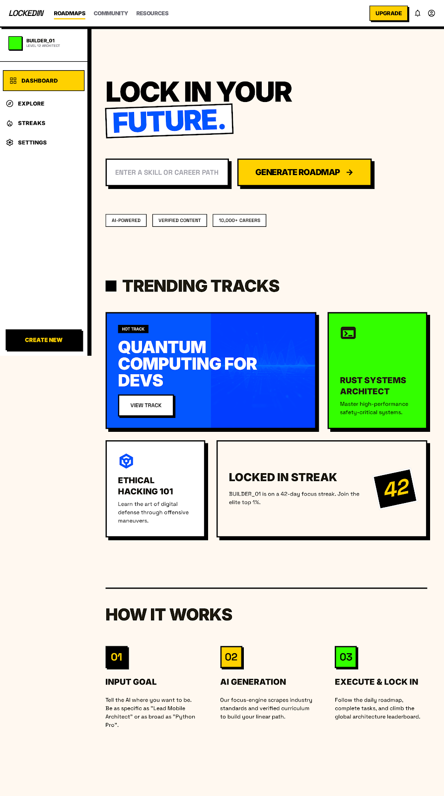
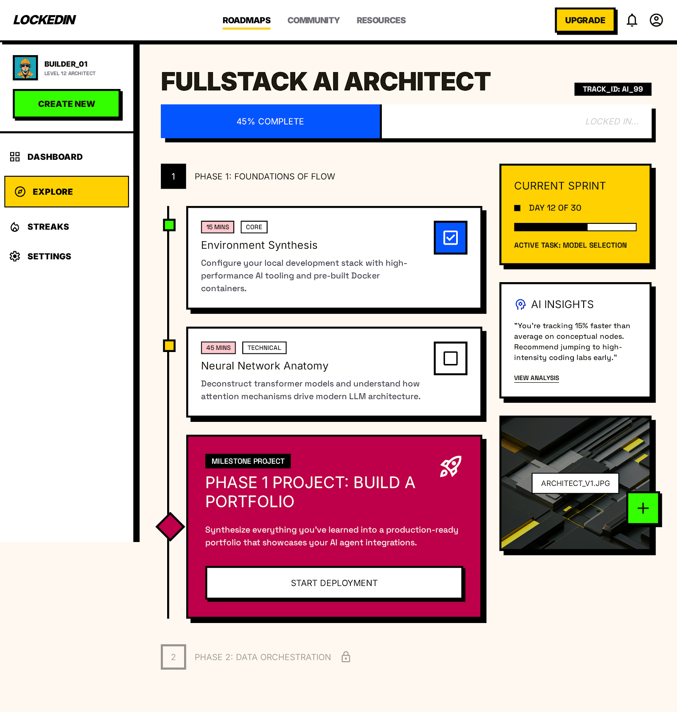
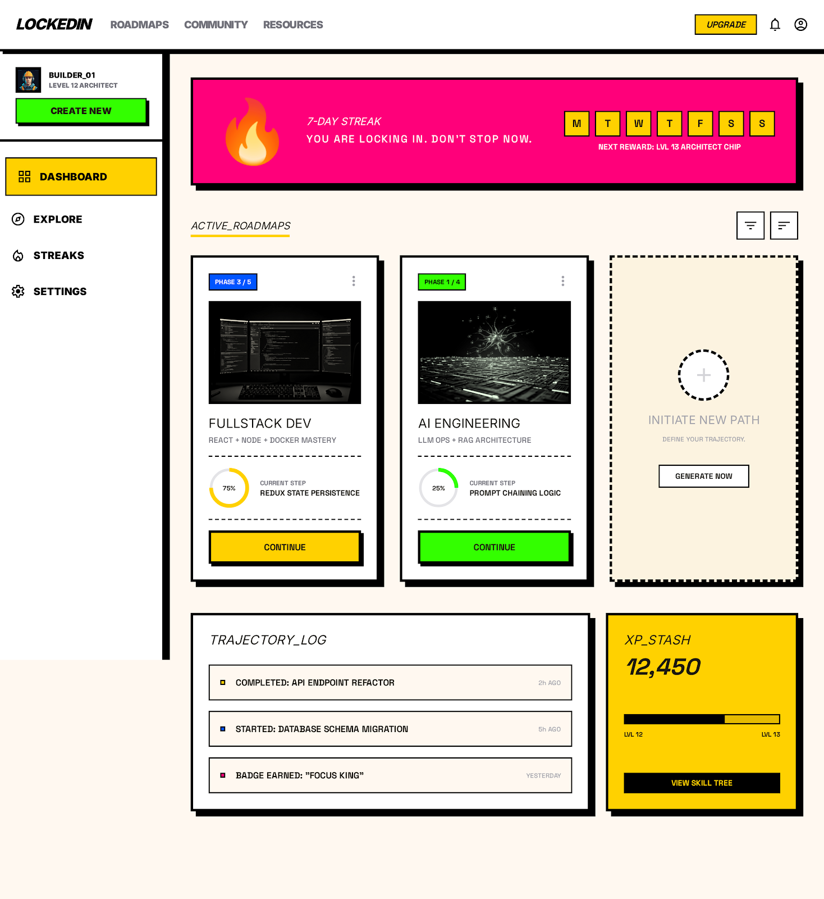
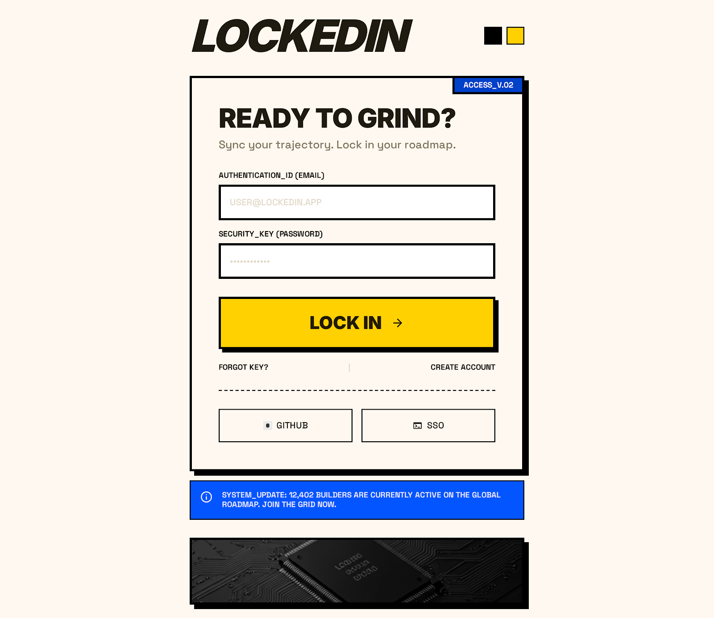

<p align="center">
  <strong style="font-size:48px; letter-spacing:-2px;">LOCKEDIN</strong>
</p>

<h3 align="center">AI-powered roadmap generator for <em>any</em> skill on the planet.</h3>

<p align="center">
  <em>Guitar. Python. Public speaking. Carpentry. Machine learning. Cooking. Whatever you want to master — just tell us your goal, and our AI builds a step-by-step roadmap to get you there.</em>
</p>

<p align="center">
  
  
  
  
</p>

---

## What is LockedIn?

LockedIn is a **goal-tracking platform** that generates personalized learning roadmaps for **any skill in the world** — not just tech. Whether you want to learn watercolor painting, Brazilian Jiu-Jitsu, financial modeling, or Rust systems programming, LockedIn creates a structured, phased plan with curated resources, milestone projects, and a streak system to keep you accountable.

**Just describe your goal in plain English:**

> *"I wanna get good at Python"*
> *"Help me become a better public speaker in 2 months"*
> *"I want to learn guitar from scratch"*
> *"Teach me how to cook Italian food"*

Our AI parses your intent, identifies the skill, your current level, and timeline — then generates a complete roadmap.

---

## Screenshots

<table>
  <tr>
    <td><br><em>Landing — Conversational skill input</em></td>
    <td><br><em>Roadmap — Phased nodes with HTMX checkmarks</em></td>
  </tr>
  <tr>
    <td><br><em>Dashboard — Track all roadmaps & streaks</em></td>
    <td><br><em>Auth — Neo-brutalist login/signup</em></td>
  </tr>
</table>

---

## Features

### AI Roadmap Generation
- **Conversational input** — just describe what you want to learn in natural language
- Works for **any skill**: tech, creative, athletic, academic, professional, or personal
- AI extracts skill, level, and goals from your input
- Generates structured phases with learning nodes, resources, and milestone projects

### Progress Tracking (HTMX)
- **Instant checkmarks** — mark nodes complete without page reload (HTMX `hx-post`)
- Progress bar updates in real-time
- Project milestones at the end of each phase
- Guest users can preview roadmaps; progress saves on signup

### Streak System
- Calendar-day–based streak tracking (not 24-hour windows)
- Streaks increment when you complete at least one node per day
- Longest streak is tracked and displayed on the dashboard
- Resets to 1 if you miss a day

### Guest → Authenticated Flow
- **No signup required** to generate and view a roadmap
- Clicking a checkmark as a guest prompts a signup modal
- Roadmap is automatically saved to your account on signup/login
- Session-based hand-off — zero friction

### Neo-Brutalist Design
- Bold 4px black borders, hard shadows, zero border-radius
- Vibrant color palette: `#FFD100` gold, `#33FF00` neon green, `#0055FF` blue, `#FF007A` pink
- Typography: Inter (display/headlines) + Space Grotesk (body/mono)
- Material Symbols icons with variable weight/fill

---

## Tech Stack

| Layer | Technology |
|-------|-----------|
| **Backend** | Django 6.0.4 (Python 3.12+) |
| **Frontend** | HTML + Tailwind CSS (CDN) |
| **Interactivity** | HTMX 2.0.4 — SPA-like nav with `hx-boost`, partial swaps for checkmarks |
| **Database** | SQLite (dev) — swap to PostgreSQL for production |
| **Auth** | Django's built-in `User` model + session auth |
| **AI Pipeline** | Pluggable — see [AI Integration](#-ai-integration) below |

---

## Quick Start

### Prerequisites
- Python 3.12+
- pip

### Setup

```bash
# Clone the repo
git clone https://github.com/Tarvel/LockedIn.git
cd LockedIn

# Create and activate virtual environment
python -m venv venv
source venv/bin/activate  # Windows: venv\Scripts\activate

# Install dependencies
pip install django

# Run migrations
python manage.py migrate

# Create a superuser (optional — for admin panel)
python manage.py createsuperuser

# Start the dev server
python manage.py runserver
```

Open **http://localhost:8000** and start locking in.

---

## Project Structure

```
LockedIn/
├── manage.py
├── lockedin/                  # Django project config
│   ├── settings.py
│   ├── urls.py
│   └── wsgi.py
├── core/                      # Main application
│   ├── models.py              # Roadmap, NodeProgress, ProjectProgress, Streak
│   ├── views.py               # All views + HTMX endpoints
│   ├── urls.py                # URL routing
│   ├── admin.py               # Admin panel registrations
│   └── ai.py                  # AI pipeline (see below)
├── templates/
│   ├── base.html              # Shared layout (HTMX, Tailwind, nav)
│   ├── landing_page.html      # Conversational skill input
│   ├── roadmap_view.html      # Phased roadmap with checkmarks
│   ├── user_dashboard.html    # Streak + roadmap cards
│   ├── login.html
│   ├── signup.html
│   ├── loading_screen.html
│   └── partials/              # HTMX swap targets
│       ├── node_checkbox.html
│       ├── project_checkbox.html
│       └── auth_modal.html
└── docs/screenshots/          # UI screenshots
```

---

## AI Integration

The AI roadmap generation is modular. The backend calls `core/ai.py` → `generate_roadmap(user_input)`.

### Input
The function receives the **raw conversational string** from the user (e.g. `"I wanna get good at Python"`).

### Expected Output Schema

```json
{
  "success": true,
  "data": {
    "skill": "Python for Beginners",
    "normalized_skill": "python",
    "overview": "A practical beginner roadmap...",
    "estimated_total_duration": "6-8 weeks",
    "phases": [
      {
        "id": "phase_1",
        "title": "Foundations",
        "level": "beginner",
        "goal": "Understand Python syntax and basics.",
        "estimated_duration": "2 weeks",
        "nodes": [
          {
            "id": "phase_1_node_1",
            "title": "Set up and write first scripts",
            "description": "Install Python, run simple scripts...",
            "estimated_completion_time": "2-3 hours",
            "resources": [
              {
                "id": "phase_1_node_1_resource_1",
                "title": "Python for Beginners",
                "url": "https://youtube.com/...",
                "type": "youtube_video",
                "source": "YouTube",
                "is_free": true
              }
            ]
          }
        ],
        "project": {
          "id": "phase_1_project_1",
          "title": "Simple quiz game",
          "brief": "Build a command-line quiz...",
          "tools_needed": ["Python", "Code editor"],
          "resources": []
        }
      }
    ]
  }
}
```

> **Note:** The view automatically normalizes `project` (singular) → `projects` (array) for template rendering. Both formats are supported.

If `core/ai.py` is not found, a **demo fallback** generates placeholder data so the app runs without an API key.

---

## Data Models

| Model | Purpose | Key Fields |
|-------|---------|-----------|
| `Roadmap` | Stores the full AI-generated roadmap | `skill_name`, `phases` (JSON), `overview`, `estimated_duration`, `user_input` |
| `NodeProgress` | Per-node completion tracking | `user`, `roadmap`, `node_id`, `completed` |
| `ProjectProgress` | Per-project completion tracking | `user`, `roadmap`, `project_id`, `completed` |
| `Streak` | Daily streak tracking | `current_streak`, `longest_streak`, `last_active_date` |

---

## Not Just Tech

LockedIn works for **every skill imaginable**. The AI pipeline is skill-agnostic:

| Category | Example Skills |
|----------|---------------|
| **Creative** | Guitar, watercolor, photography, creative writing, UI design |
| **Tech** | Python, React, machine learning, ethical hacking, DevOps |
| **Athletic** | Calisthenics, marathon training, yoga, rock climbing |
| **Professional** | Public speaking, project management, financial modeling |
| **Life Skills** | Cooking, personal finance, meditation, time management |
| **Languages** | Spanish, Japanese, sign language, academic writing |

If you can learn it, LockedIn can map it.

---

## Contributing

1. Fork the repo
2. Create a feature branch (`git checkout -b feature/your-feature`)
3. Commit your changes (`git commit -m 'Add your feature'`)
4. Push to the branch (`git push origin feature/your-feature`)
5. Open a Pull Request

---

## License

This project was built for a hackathon. License TBD.

---

<p align="center">
  <strong>LOCK IN YOUR FUTURE.</strong>
</p>
